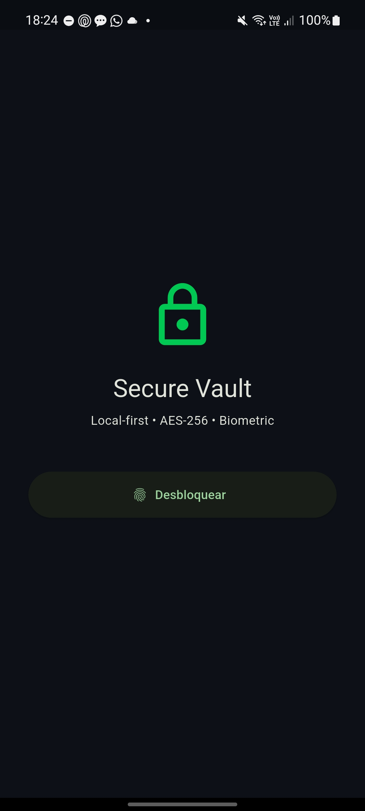
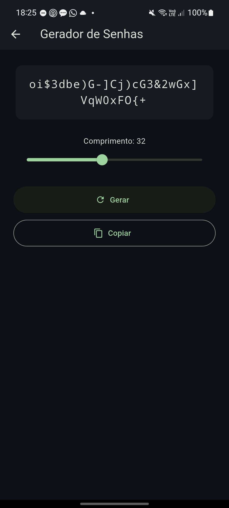
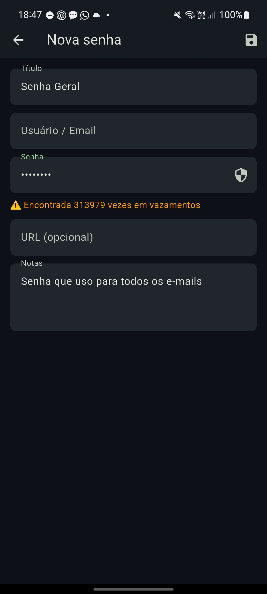

# Secure Vault 🔐🛡️

-green?style=for-the-badge&logo=android)


Gerenciador de credenciais **local-first** em **Flutter** (foco atual: Android), com armazenamento criptografado, biometria e checagem de senhas vazadas via Have I Been Pwned (k-anonymity).

> Suas credenciais permanecem no dispositivo. Não há conta, sync em nuvem nem telemetria.

Modelo de ameaça e limites: ver [SECURITY.md](SECURITY.md).

---

## Funcionalidades

- Armazenamento local de credenciais (título, usuário/email, senha, URL, notas)
- **AES-256-GCM** com IV/nonce aleatório **por operação** (formato de payload `v2:`)
- Chave em `FlutterSecureStorage` (Keystore / Keychain)
- Autenticação biométrica (`local_auth`)
- Gerador de senhas com `Random.secure()` (CSPRNG), comprimento configurável (8–64)
- Verificação de vazamentos (HIBP range API — só o prefixo SHA-1 sai do device)
- Cópia para clipboard e visualização com obscure
- Arquitetura local-first — sem servidor próprio

---

## Stack

| Camada | Tecnologia |
|--------|------------|
| Linguagem / UI | Dart 3 · Flutter |
| Estado | flutter_bloc + equatable |
| Criptografia | package `encrypt` — AES-256-GCM; `crypto` (SHA-1 para HIBP) |
| Secure storage | flutter_secure_storage |
| Biometria | local_auth |
| Rede (só HIBP) | http |
| IDs | uuid |
| Testes (dev) | flutter_test, bloc_test, mocktail |

Plataforma prioritária de uso e screenshots: **Android**. O projeto Flutter inclui pastas de outras plataformas; o foco de validação atual é Android.

---

## Criptografia (resumo)

| Item | Detalhe |
|------|--------|
| Cipher | AES-256-GCM |
| Chave | 32 bytes (`Key.fromSecureRandom`), guardada no secure storage |
| IV | 12 bytes aleatórios **por** cifragem |
| Formato | `v2:<base64(iv)>:<base64(ciphertext)>` |
| Legacy | Blobs antigos (IV fixo) tentam migrar na leitura e são regravados em v2 |

Ainda **não** há master password + KDF (Argon2/PBKDF2). A chave depende do secure storage do dispositivo + gate biométrico. Detalhes e roadmap cripto em [SECURITY.md](SECURITY.md).

---

## Password leak detection

Integração com [Have I Been Pwned](https://haveibeenpwned.com/Passwords) via API de *range* (k-anonymity):

1. SHA-1 da senha no device  
2. Envio apenas dos **5 primeiros** caracteres do hash  
3. Comparação do sufixo localmente  

Exemplo de UI:

```text
⚠️ Encontrada 313979 vezes em vazamentos
✅ Não encontrada em vazamentos
```

A senha em claro **não** é enviada.

---

## Arquitetura (app)

```text
lib/
  core/           # constants, utils (EncryptionService, HibpService)
  features/
    auth/         # biometria (BLoC + LoginPage)
    vault/        # CRUD de entradas (BLoC + repository + UI)
    generator/    # gerador de senhas (BLoC + UI)
  shared/theme/
  main.dart
```

Fluxo resumido: biometria → vault (JSON de entradas cifrado em GCM) → secure storage.

---

## Build (Android)

Requisitos: Flutter SDK estável, Android SDK, device ou emulador com biometria (ou sensor simulado).

```bash
git clone https://github.com/LuizGrochevski/secure-vault.git
cd secure-vault
flutter pub get
flutter run
```

Release (exemplo):

```bash
flutter build apk --release
```

> Após atualizar para o formato `v2` (GCM): se houver dados no formato antigo, a primeira abertura tenta migrar. Se falhar, limpe os dados do app e recrie as entradas.

---

## Interface

### Tela de desbloqueio

<p align="center">
  
</p>

### Gerador de senhas

<p align="center">
  
</p>

### Verificação de vazamentos

<p align="center">
  
</p>

### Editor de credenciais

Campos: título, usuário/email, senha, URL, notas — com botão de checagem HIBP no campo de senha.

---

## Testes

Dependências de teste configuradas (`flutter_test`, `bloc_test`, `mocktail`). Cobertura automatizada completa ainda no roadmap.

```bash
flutter test
```

---

## Roadmap

- [x] Cofre local de credenciais
- [x] Gerador de senhas (`Random.secure()`)
- [x] Autenticação biométrica
- [x] UI de gerenciamento
- [x] Verificação HIBP (k-anonymity)
- [x] AES-256-GCM + IV por operação (payload v2)
- [x] Documentação do modelo criptográfico ([SECURITY.md](SECURITY.md))
- [ ] Testes automatizados completos
- [ ] Master password + KDF (Argon2id / PBKDF2)
- [ ] Fallback PIN quando biometria indisponível
- [ ] Exportação / importação / backup cifrado
- [ ] Detecção de senhas reutilizadas
- [ ] Security audit externo

---

## Autor

**Luiz Felipe Grochevski** — [GitHub](https://github.com/LuizGrochevski)

---

## Aviso

Projeto **educacional / experimental**. Não use como único cofre para credenciais críticas sem avaliação de segurança independente.

---

## Licença

MIT
